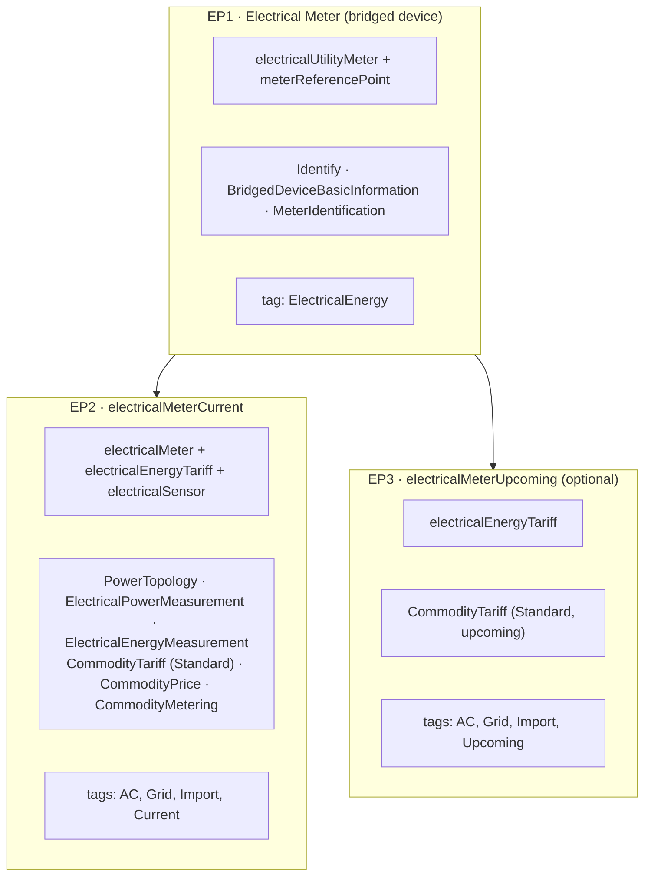

# &nbsp;&nbsp;&nbsp;Matterbridge Example: Electrical Meter

This repository is a generic Matterbridge plugin example — based on [matterbridge-plugin-template](https://github.com/Luligu/matterbridge-plugin-template) — implementing the **"Basic Utility Meter" endpoint topology** from the Matter 1.6 spec (§14.9.6.1, `chip/1.6.0/specs`), built with `MatterbridgeEndpoint.addChildDeviceType()`:

- EP1 (parent): `electricalUtilityMeter` (0x0511, requires `MeterIdentification`) + `meterReferencePoint` (0x0512, requires `Identify`).
- EP2 (child): `electricalMeter` (0x0514) + `electricalEnergyTariff` (0x0513) + `electricalSensor` (0x0510) — the combination this example is named after, holding the simulated power/energy measurement clusters.
- EP3 (optional child): `electricalEnergyTariff` alone, for the upcoming tariff period.

None of `CommodityTariff`, `CommodityPrice` (both optional on `electricalEnergyTariff`) or `CommodityMetering` (optional on `electricalMeter`) are required clusters, but EP2 carries all three and EP3 carries `CommodityTariff` — matching the clusters shown on these endpoints in the spec's topology figure. Each is a minimal, static flat rate (`src/flatTariff.ts`, `src/commodityExtras.ts`): a single tariff component covering the whole day, every day — just enough to show each cluster's shape without day/night scheduling. `CommodityMetering.meteredQuantity` is refreshed on the same periodic timer as `ElectricalEnergyMeasurement`.

The plugin registers the whole tree with a single `registerDevice()` call at startup and refreshes EP2's simulated power/energy readings on a configurable interval (`updateIntervalSeconds`, default 10s) — there is no real hardware involved, it's purely illustrative.

## Features

- **Dev Container support for instant development environment**.
- Pre-configured TypeScript, TypeScript Native (tsgo), Oxlint, Oxfmt and Vitest.
- The Matter 1.6 "Basic Utility Meter" parent/child endpoint topology (EP1/EP2/EP3), built with `addChildDeviceType()` and semantic tags (`getSemtag()`).
- Simulated power/energy readings refreshed on a timer, to illustrate `setAttribute()` usage on a child endpoint's clusters.
- Minimal flat-rate `CommodityTariff`, `CommodityPrice` and `CommodityMetering` on EP2/EP3, to illustrate each cluster's shape without a full day/night schedule.
- Configured Vitest test unit that you can expand while you add your own plugin logic.

## Available workflows

The project has the following already configured workflows:

- **build.yml**: run on push and pull request and build, lint and test the plugin on node 20, 22 and 24 with ubuntu, macOS and windows.
- **publish.yml**: publish on npm under tag latest when you create a new release in GitHub and publish under tag dev on npm from main (or dev if it exist) branch every day at midnight UTC if there is a new commit. The workflow has been updated for trusted publishing / OIDC, so you need to setup the package npm settings to allow it (i.e. authorize publish.yml).
- **codeql.yml**: run CodeQL from the main branch on each push and pull request.
- **codecov.yml**: run CodeCov from the main branch on each push and pull request. You need a codecov account and to add your CODECOV_TOKEN to the repository secrets.

## ⚠️ Warning: GitHub Actions Costs for Private Repositories

**Important**: If you plan to use this template in a **private repository**, be aware that GitHub Actions usage may incur costs:

- **Free tier limits**: Private repositories have limited free GitHub Actions minutes per month (2,000 minutes for free accounts).
- **Workflow intensity**: This template includes multiple workflows that run on different operating systems (Ubuntu, macOS, Windows) and Node.js versions (20, 22, 24), which can consume minutes quickly.
- **Daily automated workflows**: The dev publishing workflows run daily, which can add up over time.
- **Pricing varies by OS**: macOS runners cost 10x more than Ubuntu runners, Windows runners cost 2x more.

**Recommendations for private repos**:

- Monitor your GitHub Actions usage in your account settings.
- Consider disabling some workflows or reducing the OS/Node.js version matrix.
- Review GitHub's [pricing for Actions](https://github.com/pricing) to understand costs.
- For public repositories, GitHub Actions are free with generous limits.

## Getting Started

1. Create a repository from this template using the [template feature of GitHub](https://docs.github.com/en/repositories/creating-and-managing-repositories/creating-a-repository-from-a-template).
2. Clone it locally and open the cloned folder project with [VS Code](https://code.visualstudio.com/). If you have docker or docker desktop, just run `code .`.
3. When prompted, reopen in the devcontainer. VS Code will automatically build and start the development environment with all dependencies installed.
4. Update the code and configuration files as needed for your plugin. Change the name (keep always matterbridge- at the beginning of the name), version, description, author, homepage, repository, bugs and funding in the package.json.
5. Follow the instructions in the matterbridge [README-DEV](https://github.com/Luligu/matterbridge/blob/main/README-DEV.md) and comments in module.ts to implement your plugin logic.

## Periodical Updates

This template evolves over time to keep up with Matterbridge, Node.js, TypeScript, and the surrounding tooling ecosystem. Periodically pulling in the latest template changes helps your plugin benefit from:

- Security and dependency updates (Node.js and tooling).
- CI improvements (new Node versions, workflow hardening, and cross-platform fixes).
- Developer experience updates (Dev Container tweaks, lint/format configs, test runner updates).

If your plugin repository was created from this template, it’s a good habit to review new template releases/commits and selectively copy the relevant files into your plugin repo. Typical “template-owned” areas to keep in sync include:

- `.agents/` (Agents / Codex AI settings)
- `.claude/` (Claude AI settings)
- `.codex/` (Codex AI settings)
- `.devcontainer/` (development environment and extensions)
- `.github/` (Copilot AI setting and build/publish/CodeQL/Codecov pipelines)
- `.vscode/` (repo settings and tasks coordinated with tooling configs)
- `AGENTS.md` (Codex AI instructions)
- `CLAUDE.md` (Claude AI instructions)
- `STYLEGUIDE.md` (Generic AI instructions)
- Tooling configs like `.oxlintrc.json`, `.oxfmtrc.json`, `tsconfig*.json`, `jest.config.js`, `vite.config.ts`
- Helper scripts under `scripts/` (release/version automation)

Tip: prefer copying and adapting these files rather than rewriting them from scratch—staying close to the template makes future updates faster and less error-prone.

## Using the Dev Container

- Docker Desktop or Docker Engine are required to use the Dev Container.
- Devcontainer works correctly on Linux, macOS, Windows, WSL2.
- The devcontainer provides Node.js, npm, TypeScript, ESLint, Prettier, Jest, Vitest and other tools and extensions pre-installed and configured.
- The dev branch of Matterbridge is already build and installed into the Dev Container and linked to the plugin. The plugin is automatically added to matterbridge.
- The devcontainer is optimized using named mounts for node_modules, .cache and matterbridge.
- You can run, build, and test your plugin directly inside the container.
- To open a terminal in the devcontainer, use the VS Code terminal after the container starts.
- All commands (npm, tsc, matterbridge etc.) will run inside the container environment.
- All the source files are on the host.

## Dev containers networking limitations

Dev containers have networking limitations depending on the host OS and Docker setup.

• Docker Desktop on Windows or macOS:

- Runs inside a VM
- Host networking mode is NOT available
- Use the Matterbridge Plugin Dev Container system (https://matterbridge.io/reflector/MatterbridgeDevContainer.html) for development and testing. It provides a similar environment to the native Linux setup with the following features:

  ✅ Is possible to pair with an Home Assistant instance running in docker compose on the same host

  ✅ mDNS works normally inside the containers

  ✅ Remote and local network access (cloud services, internet APIs) work normally

  ✅ Matterbridge and plugins work normally

  ✅ Matterbridge frontend works normally

- Use the Matterbridge mDNS Reflector with the Matterbridge Plugin Dev Container system (https://matterbridge.io/reflector/Reflector.html) if you want to pair with a controller on the local network with the following features:

  ✅ Is possible to pair with a controller running on the local network using mDNS reflector

  ✅ mDNS, remote and local network access (cloud services, internet APIs) work normally

  ✅ Matterbridge and plugins work normally

  ✅ Matterbridge frontend works normally

• Native Linux or WSL 2 with Docker Engine CLI integration:

- ✅ Host networking IS available (with --network=host)

- ✅ Full local network access is supported

- ✅ Matterbridge and plugins work correctly, including pairing

- ✅ Matterbridge frontend works normally

## Repository setup

> **Note:** This repository uses a new toolchain. It replaces the traditional TypeScript / ESLint / Prettier / Jest stack with a faster, lighter setup.

- The traditional TypeScript package has been replaced by **[TypeScript Native 7](https://github.com/microsoft/typescript-go)**.
- **No ESLint, no Prettier** — replaced by the [oxc](https://oxc.rs) stack: **[oxlint](https://oxc.rs/docs/guide/usage/linter.html)** for linting and **[oxfmt](https://oxc.rs/docs/guide/usage/formatter.html)** for formatting.
- Testing with **[Vitest](https://vitest.dev)**, which is much faster and natively supports ESM without extra configuration.
- **Far fewer development dependencies** — the number of installed packages drops from **~600** to **~60**. A clean install is much faster.
- **Much faster linting and formatting** — oxlint and oxfmt run in a fraction of the time required by the ESLint / Prettier pipeline.
- **Much faster builds** — tsgo compiles the project in a fraction of the time required by the standard `tsc` build.
- **Editor support** — uses the VS Code extensions for tsgo and oxc to get the same experience in the editor.

## Style guide

See also the [Style Guide](./STYLEGUIDE.md) for JSDoc, naming, and logging conventions used in this repository.

## Copilot instructions

| File                                                                   | Notes                                                                              |
| ---------------------------------------------------------------------- | ---------------------------------------------------------------------------------- |
| `.github/copilot-instructions.md`                                      | Main project instructions — always loaded                                          |
| `.github/instructions/chip-tests/chip-tests.instructions.md`           | CHIP conformance test harness — scoped to CHIP test files                          |
| `.github/instructions/matterbridge/matterbridge.instructions.md`       | Matterbridge endpoint guide — dedicated Copilot instruction file                   |
| `.github/instructions/plugin-frontend/plugin-frontend.instructions.md` | Plugin frontend SPA and custom REST API guide — scoped to frontend and plugin code |
| `.github/instructions/testing/unit-tests.instructions.md`              | Testing standards — scoped to `**/*.test.ts`                                       |

## Claude instructions

| File                                                            | Notes                                                                              |
| --------------------------------------------------------------- | ---------------------------------------------------------------------------------- |
| `CLAUDE.md`                                                     | Main project instructions — always loaded                                          |
| `.claude/rules/chip-tests/chip-tests.instructions.md`           | CHIP conformance test harness — scoped to CHIP test files                          |
| `.claude/rules/matterbridge/matterbridge.instructions.md`       | Matterbridge endpoint guide — loaded for all contexts                              |
| `.claude/rules/plugin-frontend/plugin-frontend.instructions.md` | Plugin frontend SPA and custom REST API guide — scoped to frontend and plugin code |
| `.claude/rules/testing/unit-tests.instructions.md`              | Testing standards — scoped to `**/*.test.ts`                                       |

## Codex/Agents instructions

| File                         | Notes                                             |
| ---------------------------- | ------------------------------------------------- |
| `AGENTS.md`                  | Main project instructions                         |
| `.agents/chip-tests.md`      | CHIP conformance test harness                     |
| `.agents/matterbridge.md`    | Matterbridge endpoint guide                       |
| `.agents/plugin-frontend.md` | Plugin frontend SPA and custom REST API guide     |
| `.agents/testing.md`         | Testing and validation expectations               |
| `.codex/config.toml`         | Codex project permissions, approvals, and profile |
| `.codex/rules/default.rules` | Codex command allow, prompt, and deny rules       |

## Documentation

Refer to the Matterbridge [documentation](https://matterbridge.io) for other guidelines.

---
